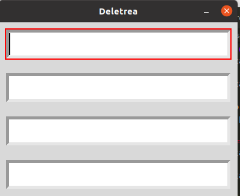
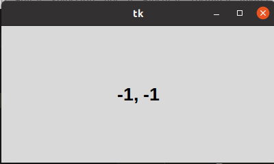
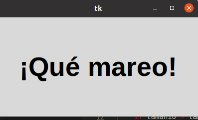

# 3. metodos comunes

## Metodos comunes foco 

#### Este gestor va cambiando en cierto tiempo el foco donde se escribe, si se escribe en todas lo mismo, se gana.

#### Nos muestra las coordenadas del raton mientras nos movemos.

## Metodos comunes posicion raton

#### Se aumenta o disminuye el tamaño de la letra en un intervalo de tiempo

## Metodos comunes temporizadores

