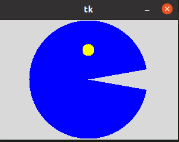
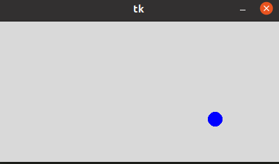
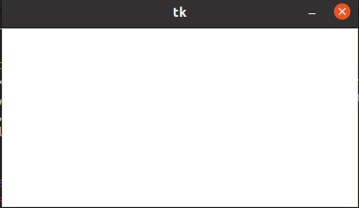
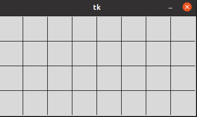
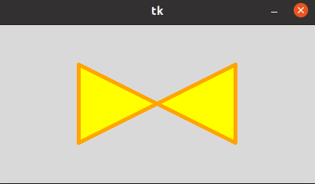
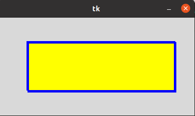
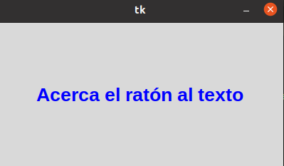
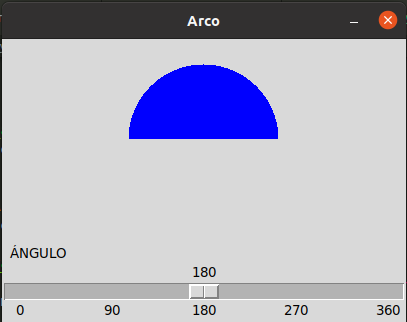

# 6 canvas

## Canvas arco 
###  

## Canvas circulo
### 

## Canvas imagen
### 

## Canvas lineas
###  

## Canvas poligono
###  

## Canvas rectangulo
### 

## Canvas text
### 

## scale arco
### 

