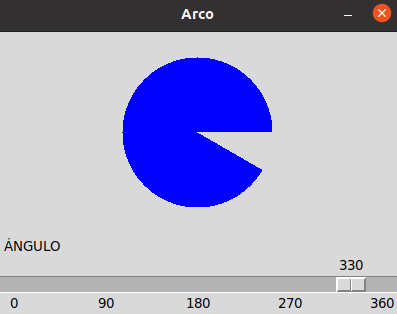

## Ejercicio 5 widgets
## button
###  Medir el tiempo como un cronometro

## entry
### Nos permite  colocar un usuario y una contraseña

## label reloj
### Ver la hora exacta

## listbox
###  Traducir palabras de cuatro paises diferentes

## menu 
###  Menu que tiene diferentes opciones

## menubutton
### Formulario donde nos piden dar un nombre, direccion,sexo, provincia, edad

## messagebox
### Menu desplegable que nos da diferentes opciones

## optionmenu
### Es un menu que nos pide dar diferentes datos como la edad, la provincia, el nombre y la direccion

## scale arco
###  Medir un angulo segun los grados dados

## scroll
###  Menu con un tamaño mas grande que tambien contiene varias opciones

## spinbox
### esto es un formulario que contiene menos opciones que que los anteriores

## text
### Menu

## toplevel
###  Menu que nos da un formulario que al dar clik en accedernos manda a una ventana donde hay un formulario que nos permite ingresar algunos datos

